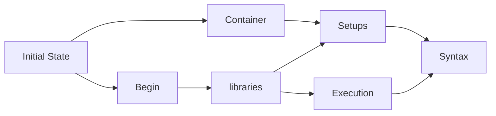
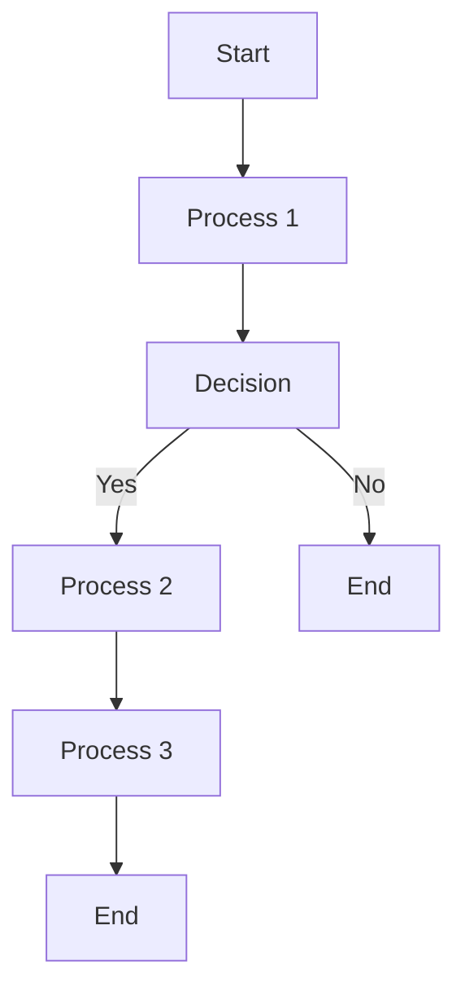
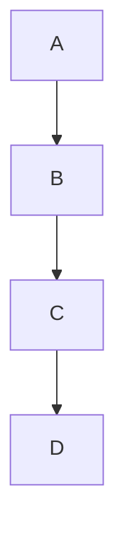

This is the readme file that contains all I need to know about running the software.

Left to right flow

```mermaid
flowchart LR

A[Initial State] --> B[Container]
A --> C[Begin]
B --> D[Setups]
C --> E[libraries]
E --> D
D --> F[Syntax]
E --> G[Execution]
G --> F
```

Top down flow

``` mermaid
    graph TD
        A[Start] --> B[Process 1]
        B --> C[Decision]
        C -->|Yes| D[Process 2]
        C -->|No| E[End]
        D --> F[Process 3]
        F --> G[End]
```

Top Down flow

``` mermaid
graph TD

    A-->B

    B-->C

    C-->D
```